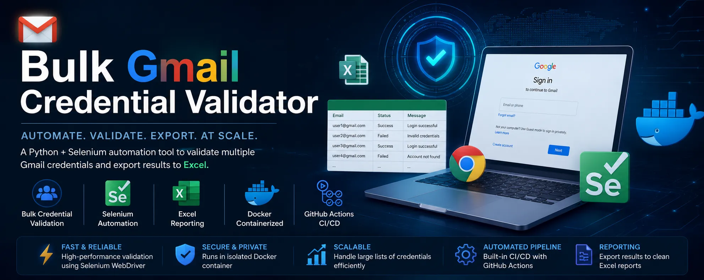
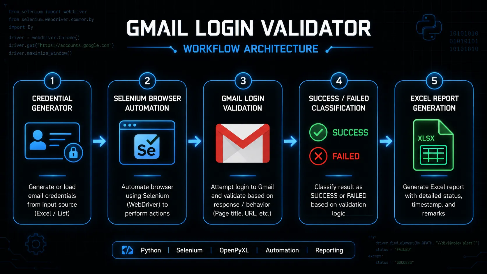
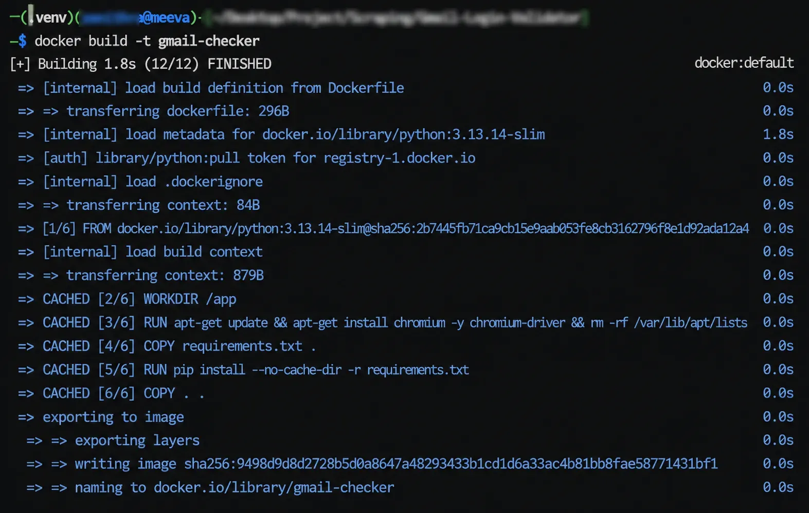
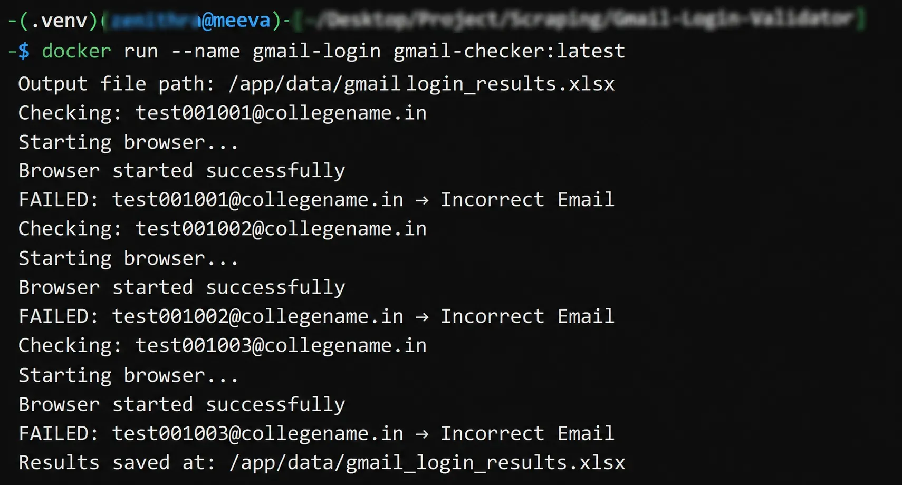
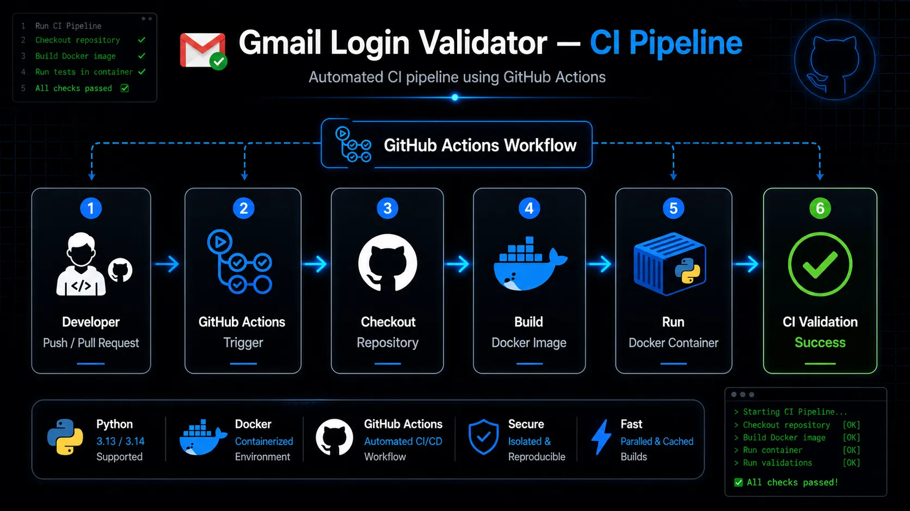
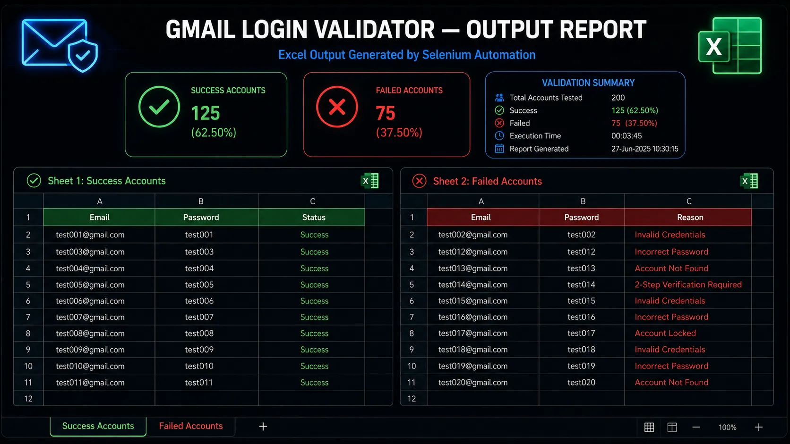

# Gmail Login Validator



[](https://github.com/sonukkushwaha0801/Gmail-Login-Validator/actions/workflows/docker-ci.yml)

---

## Overview

Gmail Login Validator is a Python Selenium automation project designed to validate bulk Gmail credentials by automating the Google login workflow.

The system automatically:

- Generates credentials
- Attempts Gmail login
- Detects login success/failure
- Stores results into structured Excel reports

This project demonstrates practical browser automation, credential validation, workflow automation, reporting, Docker containerization, and CI/CD automation.

---

## Features

- Bulk credential generation
- Automated Gmail login validation
- Success / Failure classification
- Excel report generation
- Docker support
- GitHub Actions CI pipeline
- Exception handling
- Modular project structure

---

## Tech Stack

- Python
- Selenium
- Pandas
- OpenPyXL
- Docker
- GitHub Actions

---

## Project Structure

```bash
gmail-login-validator/
│
├── .github/
│   └── workflows/
│       └── ci.yaml
│
├── assets/
│   ├── banner.webp
│   ├── workflow-diagram.png
│   ├── docker-build.png
│   ├── docker-run.png
│   └── ci-pipeline.png
│
├── data/
│   └── gmail_login_results.xlsx   # Generated after script execution
│
├── src/
│   ├── config.py
│   ├── credential_generator.py
│   ├── login_validator.py
│   ├── excel_handler.py
│   └── main.py
│
├── Dockerfile
├── USE_CASES.md
├── requirements.txt
├── .gitignore
└── README.md
```

---

## Workflow

```text
Generate Credentials
       ↓
Validate Gmail Login
       ↓
Classify Result
       ↓
Success / Failed
       ↓
Generate Excel Report
```

---

## Workflow Architecture



---

## Installation

Clone repository:

```bash
git clone https://github.com/sonukkushwaha0801/Gmail-Login-Validator.git
cd Gmail-Login-Validator
```

Create virtual environment:

```bash
python -m venv .venv
```

Activate virtual environment:

### Linux / Mac

```bash
source .venv/bin/activate
```

### Windows

```bash
.venv\Scripts\activate
```

Install dependencies:

```bash
pip install -r requirements.txt
```

---

## Usage

Run the main script:

```bash
python src/main.py
```

---

## Docker Support

This project is fully containerized using Docker.

### Build Docker Image

```bash
docker build -t gmail-checker .
```

### Run Docker Container

```bash
docker run --name gmail-login gmail-checker:latest
```

### Docker Validation

#### Docker Image Build



#### Docker Container Execution



---

## CI Pipeline

This repository includes a production-ready GitHub Actions CI pipeline.

### Trigger Events

- Push to main branch
- Pull Request to main branch

### Pipeline Workflow

- Checkout Repository
- Build Docker Image
- Run Docker Container
- Validate CI Status



---

## Output

After execution, an Excel report is generated:

```bash
data/gmail_login_results.xlsx
```

The report contains 2 sheets.

### Success Sheet

| Email                                         | Password | Status           |
| --------------------------------------------- | -------- | ---------------- |
| [test001@gmail.com](mailto:test001@gmail.com) | test001  | Login Successful |
| [test002@gmail.com](mailto:test002@gmail.com) | test002  | Login Successful |

### Failed Sheet

| Email                                         | Password | Reason              |
| --------------------------------------------- | -------- | ------------------- |
| [test003@gmail.com](mailto:test003@gmail.com) | test003  | Invalid Credentials |
| [test004@gmail.com](mailto:test004@gmail.com) | test004  | Recovery Required   |

---



## Documentation

- [Use Cases & Security Importance](USE_CASES.md)

---

## Use Cases

- Bulk credential validation
- Automation testing
- Browser automation learning
- QA workflow automation
- Security auditing

---

## Future Improvements

- Better failure classification
- CAPTCHA handling
- Retry mechanism
- Logging support
- Single browser session optimization

---

## Contributors

**Author:** Sonu Kumar Kushwaha (@sonukkushwaha0801)

**Collaborator:** Zenithra (@zenithrahub)
